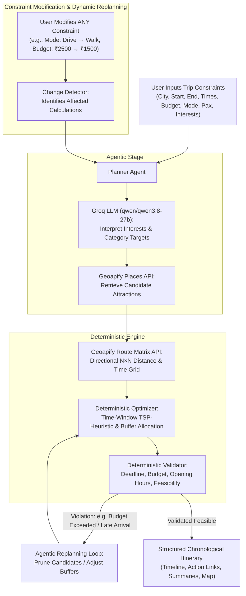
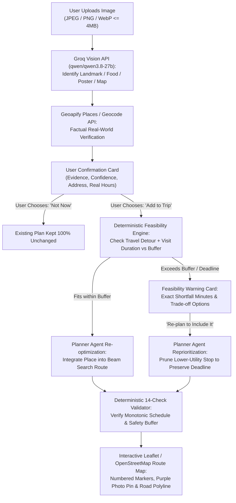

# One-Day City Planner

An agentic, multi-constraint travel assistant that generates and dynamically replans realistic one-day city itineraries using directional road networks, deterministic time-window optimization, independent constraint validation, and multimodal landmark discovery.

Built as an individual 6-week capstone project for the **Agentic AI and LLM Course**.

---

## 1. Problem Statement

Standard LLM travel planning tools suffer from three fundamental flaws:
1. **Hallucinated geography**: Generating straight-line estimates or fictional distances that ignore one-way streets, traffic flow, and directional road geometry ($A \rightarrow B \neq B \rightarrow A$).
2. **Computational hallucination**: Delegating arithmetic, opening hours, schedule fitting, and budget constraints to an LLM, leading to plans that arrive late or exceed budgets.
3. **Rigid re-prompting**: When a user changes a constraint (e.g. changing travel mode from car to walking, or slashing budget in half), basic chatbots rewrite text arbitrarily without mathematically recalculating transit feasibility.

**One-Day City Planner** solves this by strictly separating **agentic reasoning** (intent interpretation, semantic preference matching, trade-off reasoning, user interaction) from **deterministic computation** (directional road routing, time-window optimization, budget accounting, and hard constraint validation).

---

## 2. Core User Journey



---

## 3. Strict Free-Tier Architecture

This application is strictly built using **100% free-tier services**. It has **no billing dependencies**, requires **no credit card**, and uses **no paid-only APIs**.

| Component | Service / Tool | Quota & Free-Tier Rules | Purpose |
| :--- | :--- | :--- | :--- |
| **LLM Reasoning & Orchestration** | Groq Cloud (`groq-sdk`, `qwen/qwen3.8-27b`) | 30 RPM, 1,000 Requests/Day on Groq's current free plan for qwen/qwen3.8-27b (8K TPM / 200K TPD, No Card) | Intent interpretation, structured tool decisions, trade-off explanation |
| **Geocoding & Places** | Geoapify Places API | 3,000 Credits/Day (Free Tier, No Card) | Real-world coordinates, opening hours, official websites |
| **Directional Road Routing** | Geoapify Routing & Route Matrix | Included in 3,000 Credits/Day pool | True road-network directional durations and distances |
| **Map Rendering** | Leaflet & OpenStreetMap | Fair-use OpenStreetMap raster tiles (Zero Cost) | Interactive map pins and route visualization |
| **Framework & Hosting** | Next.js 15 (TypeScript, Tailwind) | Free local / Vercel Hobby | Production-grade React Server & Client architecture |

> [!IMPORTANT]
> **API Key Security**: All API keys (`GROQ_API_KEY`, `GEOAPIFY_API_KEY`) are accessed strictly on the server-side (`src/app/api/...` or server services). No secrets are exposed to client JavaScript.

---

## 4. Architectural Separation

### System Execution Hierarchy
```
User
  ↓
Next.js UI (Trip Form, Timeline, Interactive Leaflet Map)
  ↓
Planner Agent (Orchestrator & Replanning Coordinator)
  ├── Cognitive / Semantic Layer:
  │   ├── Groq API (qwen/qwen3.8-27b): Intent extraction, category mapping & trade-off rationale
  │   └── Vision Pipeline: Multimodal landmark image identification
  ├── Geographic Discovery Layer:
  │   ├── Geoapify Geocoding: Location resolution & metropolitan bounds check (10s timeout)
  │   ├── Geoapify Places: 4-tier tourist relevance taxonomy & category expansion
  │   └── Geoapify Route Matrix: Directional asymmetric N×N road transit grid
  ├── Deterministic Computation Engine:
  │   ├── Bounded Beam Search Optimizer: Multi-objective Pareto scoring (W=12, D=2)
  │   └── Constraint Validator: Independent 14-rule deterministic verification
  └── State & Session Cache:
      └── Change Detector: Typed constraint diffing & selective cache invalidation
  ↓
Validated Itinerary (Guaranteed Feasible & Within Budget/Deadline)
  ↓
Interactive Timeline + Leaflet Route Polyline + Google Maps Deep-Links
```

The codebase enforces strict layer boundaries:

```
src/
├── domain/                  # Core domain types, contracts & validation schemas
│   ├── constraints.ts       # TripConstraints, LocationPoint, TravelMode
│   ├── places.ts            # CandidatePlace, VerificationStatus, OpeningHours
│   ├── routing.ts           # RouteSegment, DirectionalRouteMatrix
│   ├── itinerary.ts         # ItineraryStop, FinalItinerary, ItinerarySummary
│   ├── validation.ts        # ValidationResult, ValidationErrorCode
│   ├── optimizer.ts         # OptimizerInput, OptimizerOutput
│   └── state.ts             # TripPlannerSessionState, ConstraintChange
├── agent/                   # Agentic orchestrator & replanning coordinator
│   └── plannerAgent.ts      # Orchestrates LLM, tools, optimizer, validator, and replanning loops
├── services/                # Deterministic tool & LLM API clients
│   ├── groq/                # Groq (qwen/qwen3.8-27b) client & structured decision prompts
│   └── geoapify/            # Geoapify Geocoding, Places, Routing, and Route Matrix
├── optimizer/               # Pure deterministic itinerary optimizer
│   └── index.ts             # Time-windowed TSP heuristic & safety buffer allocator
├── validator/               # Pure deterministic validator
│   └── index.ts             # Hard constraint enforcement (deadlines, budgets, open hours)
├── state/                   # State diffing & change detection
│   └── changeDetector.ts    # Determines what changed and which calculations are invalidated
├── components/              # Clean React/Tailwind UI components
│   ├── layout/              # Header and Footer
│   └── planner/             # TripForm, ItineraryTimeline, ItinerarySummary, MapPlaceholder, MultimodalUpload
└── app/                     # Next.js App Router & secure server API endpoints
    ├── api/plan/route.ts    # Server endpoint for planning & replanning
    ├── api/vision/route.ts  # Server endpoint for multimodal landmark verification
    └── page.tsx             # Main dashboard
```

---

## 5. Core Subsystems

### A. Deterministic Optimizer
- **Hard Constraints**: Start point, end point (deadline arrival), budget, travel mode, pax size.
- **Directional Non-Symmetric Matrix**: Evaluates $A \rightarrow B$ independently from $B \rightarrow A$.
- **Objectives**:
  - Minimize transit travel time.
  - Minimize backtracking loops.
  - Maximize user interest alignment.
  - Preserve a dedicated safety buffer (default: 15–20 minutes) rather than arriving at the exact minute of the deadline.

### B. Independent Deterministic Validator
Validates proposed itineraries without LLM interference. Returns structured diagnostics:
- `VALID`
- `INVALID` with exact reasons:
  - `BUDGET_EXCEEDED` (with exact excess amount in currency)
  - `END_TIME_VIOLATED` (with exact minutes late against user deadline)
  - `INSUFFICIENT_VISIT_DURATION`
  - `INSUFFICIENT_BUFFER`
  - `PLACE_CLOSED`

### C. Change Detection & Dynamic Replanning
When the user edits any input (e.g. changes `travelMode` from `drive` to `walk`):
1. `detectConstraintChanges()` computes a typed diff.
2. Identifies affected components:
   - Travel mode change $\rightarrow$ Recalculate route matrix and transit times.
   - Budget change $\rightarrow$ Re-evaluate candidate costs and filter set.
   - End point change $\rightarrow$ Recalculate final leg and deadline slack.
3. Triggers targeted recalculation while preserving unchanged preferences.

### D. Multimodal Landmark Discovery (Milestone 6 Prepared)
1. User uploads a photo (landmark, museum poster, attraction screenshot).
2. Groq Vision analyzes the image and identifies potential locations with explicit confidence levels (`high`, `medium`, `low`).
3. The system queries Geoapify Places to factually verify existence and coordinates.
4. Asks the user: *"Would you like to add this to your trip?"* (never automatically forced into the plan).
5. If added, checks itinerary feasibility and recalculates the schedule.

---

## 6. Location & Directional Routing Tool Layer (Geoapify Integration)

### A. Geoapify Services Used
- **Geocoding API (`/v1/geocode/search`)**: Resolves human-entered locations with strict city context (e.g., `"VNR VJIET, Hyderabad"`).
- **Directional Routing API (`/v1/routing`)**: Computes directional road-network route segments, durations, and distances.
- **Route Matrix API (`/v1/routematrix`)**: Computes $N \times M$ directional distance and duration matrices.

### B. Matrix Size Protection (1,000 Cells Hard Limit)
Geoapify enforces a maximum limit of **1,000 source $\times$ target cells** per request.
- $2 \times 2 = 4$ cells (Start & End)
- $10 \times 10 = 100$ cells
- $31 \times 31 = 961$ cells ($\le 1000$, allowed)
- $35 \times 35 = 1,225$ cells ($> 1000$, blocked)
The service layer includes an active guard in `GeoapifyMatrixService` that rejects requests exceeding 1,000 cells before dispatching HTTP traffic, returning structured diagnostics.

### C. Directional Routing Design
Road geometry, one-way avenues, and traffic regulations mean that travel between two places is directional:
$$\text{duration}(A \rightarrow B) \neq \text{duration}(B \rightarrow A)$$
The Route Matrix service explicitly structures outputs as non-symmetric matrices (`matrix[originId][destinationId]`), allowing the deterministic optimizer to evaluate true road-network paths.

### D. Supported Travel Modes
- `drive`: Modeled using Geoapify `drive` mode.
- `walk`: Modeled using pedestrian-accessible footpaths and sidewalks.
- `bicycle`: Modeled using cycling infrastructure and elevation gradients.
- `transit`: Requires regional GTFS timetable feed; if unsupported in a region, reports structured `NO_ROUTE`.
- *Unsupported Modes* (e.g. `submarine`, `helicopter`) are rejected with `UNSUPPORTED_TRAVEL_MODE` structured errors. The system never silently substitutes a different travel mode.

### E. Traffic Model & Travel Time Semantics
- **Motorized Travel (`drive`)**: Utilizes Geoapify's `approximated` traffic model. Documented honestly as a **"traffic-aware approximate estimate"**, not guaranteed live real-time conditions.
- **Pedestrian & Cycling (`walk`, `bicycle`)**: Categorized as `not_applicable` traffic models, representing **"road-network travel estimates"**.
- Metadata (`trafficModel: "approximated" | "free_flow" | "not_applicable"`) is explicitly stored on every route segment.

### F. Quota-Conscious Caching
To protect the free-tier quota (3,000 daily requests):
- An in-memory server-side cache (`RouteCache`) caches point-to-point and matrix requests using 5-decimal rounded coordinates (~1.1m precision), travel mode, and traffic model.
- Includes a 30-minute TTL and automated eviction.
- No paid external database required.

### G. How to Configure & Test

1. **Configure API Key**:
   Add your Geoapify free API key to `.env.local`:
   ```bash
   GEOAPIFY_API_KEY=your_geoapify_key_here
   ```

2. **Run Automated Test Suite (CLI)**:
   ```bash
   npm run test:tools
   ```
   Exercises all 6 development test cases (TEST A through TEST F).

3. **Run API Integration Endpoint**:
   Start the dev server (`npm run dev`) and test via HTTP:
   ```bash
   # Automated test suite
   curl http://localhost:3001/api/tools/run-tests

   # Custom start/end directional test
   curl -X POST http://localhost:3001/api/tools/route-test \
     -H "Content-Type: application/json" \
     -d '{"city":"Hyderabad","start":"VNR VJIET","end":"Hyderabad Railway Station","travelMode":"drive"}'
   ```
4. **Interactive Dashboard Tester**:
   Open `http://localhost:3000` (or `3001`) to use the collapsible **"Tool Layer Verification"** panel with one-click presets.

---

## 7. Candidate Place Discovery & Ranking (Milestone 3)

The candidate discovery layer retrieves real places from **Geoapify Places API v2** (`GET /v2/places`), maps user interests, enforces geographic planning corridors, deduplicates records, and applies deterministic scoring to form a balanced candidate pool.

### A. Geographic Planning Corridor
- Calculates bounding box between resolved start & end points: `rect:minLon,minLat,maxLon,maxLat` with configurable margin ($\sim 4$ km) and minimum span ($12$ km) to ensure city attractions are captured even when start/end are close.
- Sets proximity bias to corridor midpoint: `bias=proximity:centerLon,centerLat`.

### B. Category Mapping & Balanced Defaults
- Centralized mapping (`categoryMapping.ts`):
  - `history`: `tourism.sights`, `tourism.sights.archaeological_site`, `heritage`, `building.historic`
  - `food`: `catering.restaurant`, `catering.cafe`
  - `culture`: `entertainment.museum`, `entertainment.culture`
  - `nature`: `leisure.park`, `leisure.nature_reserve`
  - `shopping`: `commercial.shopping_mall`, `commercial.marketplace`
  - `architecture`: `tourism.sights`, `building.historic`, `tourism.sights.place_of_worship`
- **Default Strategy**: When interests are empty, queries a balanced mix across sights, museums, dining, parks, and shopping.

### C. Deduplication Strategy
- **Primary**: Geoapify `place_id`.
- **Secondary**: Normalized name (alphanumeric lowercase) + Haversine distance $\le 100\text{ meters}$.

### D. Transparent Scoring Formula
```
candidateScore = (0.30 × interestRelevance) + (0.25 × geographicPracticality)
               + (0.10 × openingCompatibility) + (0.10 × budgetCompatibility)
               + (0.10 × qualitySignal) + (0.10 × diversityBonus)
               - (0.15 × travelBurdenPenalty) - timeFeasibilityPenalty
```
- Attached inspectable `scoreBreakdown` object explains the exact score decomposition for every candidate.

### E. Confidence Models (Zero Fabrication Guarantee)
- **Duration Model**: Provider duration $\rightarrow$ category default (`museum`: 90m, `historic`: 75m, `restaurant`: 60m, `park`: 45m). Attributed with `visitDurationSource: "category_default" | "provider"`.
- **Cost Model**: Free public places evaluated as `free` (₹0); dining estimated at ₹450/person (`costSource: "estimated"`); ticketed attractions without published fee marked `costSource: "unknown"`. Ticket prices are **never invented**.
- **Booking URLs**: Set strictly to `undefined` unless verified provider URL exists.

### F. API Quota Safety & Caching
- Category queries capped at 6–8 results per slice to protect free-tier result-based billing.
- In-memory `PlacesCache` (30-min TTL) serves repeated identical queries with zero API credit consumption.

### G. How to Test Candidate Discovery
```bash
# Run CLI test suite (Tests A through G)
npm run test:candidates

# Or test HTTP endpoint
curl http://localhost:3000/api/candidates/run-tests
```

---

## 8. Milestone 4: Deterministic Itinerary Optimizer & Safety Buffer Validation

The deterministic optimizer converts candidate places ($\le 15$), directional road route matrix, and user trip constraints into an optimized chronological schedule (`START → selected activities → END`).

### Key Optimization Principles
- **Separation of Concerns**: Optimization arithmetic, route sequence generation, time-window checking, and buffer allocation are 100% deterministic (no LLM arithmetic).
- **Search Strategy**: Bounded Beam Search ($K = 150$) with dominance pruning on `(visitedMask, lastLocationId)` and immediate end-point lookahead (`departure + legToEnd + requiredBuffer <= deadline`).
- **Directional Road Network Asymmetry**: Directly consumes precomputed matrix transitions (`A::B` and `B::A` differ based on one-way streets, divided highways, and real traffic).
- **Dynamic Safety Buffer Policy**:
  $$\text{Buffer} = \min(60, \max(15, \text{round}(\text{totalTravelMinutes} \times 0.15 \times \text{modeMultiplier})))$$
  Mode multipliers: Drive (1.25x), Transit (1.30x), Walk (1.00x).
- **Opening Hours Enforcement**: Strictly evaluates opening/closing times; allows up to 30 min early arrival wait; prunes places closed during arrival or departing past closing; flags unverified hours.
- **Independent 14 Hard Constraint Validation Checks**:
  1. Starts at requested start point
  2. Ends at requested end point
  3. Strictly chronological timestamps (no backward time jumps)
  4. Zero overlapping activities
  5. Real road network travel accounted between consecutive locations
  6. Minimum visit duration respected ($\ge 15$ mins)
  7. Opening hours respected when verified
  8. Hard budget compliance
  9. Selected travel mode respected
  10. End point arrival deadline respected
  11. Safety buffer respected (positive & $\ge$ policy buffer)
  12. Valid route connection exists for every leg
  13. Zero duplicate place visits
  14. Unknown and estimated data explicitly labeled with confidence metadata
- **Zero Fabrication**: If an intermediate candidate is unreachable or route matrix cell is missing, it is excluded without inventing synthetic durations or speed averages. If no candidate fits, a safe minimal `START → END` itinerary is returned without constraint violation.

### How to Test the Optimizer
```bash
# Run CLI test suite (Tests A through I)
npm run test:optimizer

# Run HTTP endpoint
curl http://localhost:3000/api/optimizer/run-tests
```

---

## 9. Milestone 5: Planner Agent Orchestration & Dynamic Replanning

The application operates as a genuine agentic travel assistant driven by a controlled, tool-using planning agent.

> [!IMPORTANT]
> **Deterministic vs LLM Responsibility Boundary**:
> *The LLM is an orchestration/reasoning component. Deterministic services remain authoritative for routing, optimization, budget, and validation.*
> Groq (`qwen/qwen3.8-27b`) is strictly forbidden from calculating route distances, computing travel times, performing budget arithmetic, or inventing causal explanations (e.g. "heavy traffic").

### Why Groq (`qwen/qwen3.8-27b`) Was Selected
1. **100% Free-Tier Compliance**: Free-tier rate limits: 30 RPM, 8K TPM, 200K TPD, and 1,000 Requests/Day on Groq's current free plan for qwen/qwen3.8-27b with no credit card required, fully satisfying our capstone project requirements.
2. **Deterministic Tool Orchestration**: Exceptional structured JSON support (`response_format: { type: "json_object" }`), reliably emitting typed decision frames without fragile regex scraping.
3. **Low-Latency Inference**: Ultra-fast token generation keeps agentic iteration loops responsive ($< 1$ second per planning step).
4. **Factual Grounding**: Strong alignment on prompt boundaries, avoiding hallucinated destinations, URLs, or traffic justifications.
5. **Rate-Limit Resilience**: Safe handling for HTTP 429 quota exhaustion with immediate fallback to deterministic factual diff summaries.

### A. Approved Tool Registry
The agent only has access to a strictly typed, schema-validated internal tool registry:
1. `resolve_locations`: `{ city, start, end }` $\rightarrow$ Geocodes start and end points via Geoapify Geocoding API.
2. `discover_candidates`: `{ tripConstraints }` $\rightarrow$ Discovers candidate attractions within the corridor bounding box via Geoapify Places v2 API.
3. `calculate_route_matrix`: `{ locations, travelMode }` $\rightarrow$ Computes directional road-network matrix via Geoapify Route Matrix API (enforces $\le 1000$ cells and validates enum modes).
4. `optimize_itinerary`: `{ tripConstraints, candidates, routeMatrix }` $\rightarrow$ Executes deterministic bounded beam search optimizer.
5. `validate_itinerary`: `{ tripConstraints, itinerary, routeMatrix }` $\rightarrow$ Evaluates 14 independent hard constraint verification checks.
6. `analyze_uploaded_image`: Future stub for multimodal landmark recognition.

*Zero code execution, zero arbitrary URL fetching, zero unauthorized third-party API calls.*

### B. Bounded Agent Loop (`MAX_PLANNING_ITERATIONS = 6`)
To protect against runaway loops, infinite re-prompts, and excessive API consumption, the agent runs in an observable bounded loop capped at 6 iterations:
- Step 1: Input completeness & normalization (if end point is missing, requests user input directly without hallucinating).
- Step 2: Location resolution (or reuse from state).
- Step 3: Candidate place discovery (or reuse from state).
- Step 4: Directional road route matrix computation (or reuse from state).
- Step 5: Deterministic optimization.
- Step 6: Independent validation $\rightarrow$ if invalid, enters the validator-recovery loop; if valid, finalizes with factual trade-off explanation.

### C. Surgical State Invalidation & Free-Tier Quota Protection
When constraints are modified on an existing itinerary, the agent uses `computeInvalidationPlan()` to surgically invalidate only affected components:
- **Budget changed**: Preserves geocoded locations, candidate places, and road route matrix. Only re-optimizes costs.
- **Party size changed**: Recalculates group costs; preserves candidates and route matrix.
- **Travel mode changed**: Preserves geocoded locations and candidate places; recalculates route matrix for the new mode.
- **Interests changed**: Invalidate candidate pool and route matrix; preserves start/end locations.
- **Start or End point changed**: Invalidates only the affected endpoint and route matrix; preserves candidates where applicable.

### D. Validation-Recovery Loop
If optimizer output fails hard validation checks:
1. The validator returns structured errors (`BUDGET_EXCEEDED`, `END_TIME_VIOLATED`, `OPENING_HOURS_VIOLATED`, etc.).
2. The agent interprets the structured failure and surgically adapts the candidate pool (e.g. prunes the highest-cost stop or furthest detour).
3. The deterministic optimizer recalculates the schedule and re-validates.

### E. Structured Confidence Model
Confidence is deterministically derived from source data quality, never guessed by the LLM:
- **Route Confidence**: High (`"road-network estimate; not live traffic"`).
- **Place Data Confidence**: Ratio of provider-verified places vs unverified (`verified` $\ge 80\%$, `mixed`, `unverified`).
- **Opening Hours Confidence**: Percentage of verified opening windows vs unverified.
- **Cost Confidence**: Classification of `known`, `estimated`, `mixed`, or `uncertain`.
- **Overall Confidence**: Synthesized from the four dimensions.

### F. How to Test the Planner Agent
```bash
# Run CLI test suite (Tests A through J)
npm run test:agent

# Run HTTP endpoint
curl http://localhost:3000/api/agent/run-tests
```

---

## 10. Actionable Links & Data Accuracy

The system guarantees real-world integrity:
- **No Hallucinated Data**: Opening hours, ratings, and addresses are strictly sourced from Geoapify APIs or explicitly flagged as `estimated`.
- **Actionable Links**:
  - **Directions**: Real external navigation links via Google Maps URL schemes.
  - **Official Website**: Displayed only when verified from place metadata.
  - **Ticket Booking / Reservations**: Displayed only when a reliable official portal is verified. Never fabricated.

---

## 9. Setup & Getting Started

### Prerequisites
- Node.js 20+ (Node 24 LTS verified)
- Free Groq API Key ([Groq Console](https://console.groq.com/keys))
- Free Geoapify API Key ([Geoapify](https://www.geoapify.com/))

### Installation
```bash
# Clone or navigate to the project directory
cd one-day-city-planner

# Install dependencies
npm install

# Copy environment variables template
cp .env.example .env.local

# Add your free API keys to .env.local:
# GROQ_API_KEY=your_groq_api_key
# GROQ_MODEL=qwen/qwen3.8-27b
# GEOAPIFY_API_KEY=your_geoapify_key
```

### Running the Application
```bash
# Start development server with Turbopack
npm run dev

# Run type check and lint
npm run lint

# Build for production
npm run build
```

The application will be accessible at `http://localhost:3000` (or `http://localhost:3001` if port 3000 is occupied).

### Deploying to Vercel
1. Push your repository to GitHub.
2. In the [Vercel Dashboard](https://vercel.com/), select **Add New Project** and import the repository.
3. Configure the following **Environment Variables** in Vercel Project Settings:
   - `GROQ_API_KEY`: Your Groq Cloud API key.
   - `GROQ_MODEL`: `qwen/qwen3.8-27b` (or leave default).
   - `GEOAPIFY_API_KEY`: Your Geoapify API key.
4. Leave framework preset as **Next.js** and root directory as `./`.
5. Click **Deploy**.
   - Server-side Next.js route handlers (`/api/plan`, `/api/vision`, etc.) run as Vercel Serverless Functions.
   - In-memory route and candidate caches operate ephemerally with zero disk persistence dependencies.

---

## 11. Milestone 6: Multimodal Vision, Place Verification & Interactive Route Map

Milestone 6 introduces **Multimodal Image Understanding**, **Geoapify Real Place Verification**, **Deterministic Feasibility Checks**, and an **Interactive Leaflet / OpenStreetMap Route Map**.

### A. Architectural Workflow



### B. Core Capabilities

1. **Server-Side Groq Vision Analysis (`qwen/qwen3.8-27b`)**:
   - Zero chain-of-thought exposure to client.
   - Categorizes uploaded images into: `tourist_place`, `food`, `event_poster`, `tourism_map`, or `unrecognized`.
   - Strict input validation: MIME types restricted to `image/jpeg`, `image/png`, `image/webp`; maximum file size ceiling of 4MB.
   - Enforces dimension requirements ($\ge 32 \times 32$ pixels).
2. **Geoapify Place Verification (Zero Hallucination)**:
   - Vision predictions are cross-checked against real Geoapify coordinates, verified addresses, and operational categories.
   - If Geoapify returns no factual match, the place is flagged as `unverified` with explicit warnings. Never fabricates fake coordinates.
3. **Smart Special-Case Handling**:
   - **Food / Dining**: If the user uploads a dish (e.g. Hyderabadi Biryani), the system suggests nearby verified restaurants rather than scheduling food as a 2-hour monument visit.
   - **Tourism Maps / Boards**: Multi-destination boards extract candidate lists (`mapExtractedPlaces`) allowing users to choose specific sights.
   - **Ambiguous Images**: When landmark confidence $< 0.8$, alternative candidates (`possibleAlternatives`) are presented for user selection.
4. **Deterministic Feasibility Check**:
   - Calculates detour transit time + estimated visit duration against remaining schedule buffer.
   - If feasible: user clicks `[ Add & Optimize ]`.
   - If unfeasible: displays shortfall minutes, impact metrics, and offers `[ Re-plan to Include It ]` (which prunes lower-utility stops to respect arrival deadline) or `[ Not Now ]`.
5. **Interactive Leaflet / OpenStreetMap Route Map**:
   - 100% free raster tiles from OpenStreetMap.
   - Custom SVG markers: Green start pin, Red end station pin, Blue numbered stop pins, and Purple Camera badge for photo-added destinations.
   - Connected road route polylines and clickable interactive popups.

### C. Testing Milestone 6
```bash
# Run Milestone 6 Vision & Route Integration Test Suite (Tests A through L)
npm run test:vision
```

---

---

## 13. Milestone 7: Final Productization & Evaluation Benchmark

Milestone 7 completes the productionization of the One-Day City Planner with a comprehensive evaluation framework, automated failure taxonomy, interactive demo mode, and consolidated testing suite.

### A. All Test Suites & Verification Commands

| Command | Suite Description | Coverage & Scope |
| :--- | :--- | :--- |
| `npm run test:all` | **Master Test Suite (All 7 Suites)** | Runs all 7 suites sequentially; asserts 100% pass rate across the full system. |
| `npm run test:evaluation`| **Deterministic Evaluation Benchmark** | Runs 20 benchmark scenarios & 5 recovery demonstrations; generates `evaluation-results.json`. |
| `npm run test:tools` | **Tools & Geoapify API Suite** | Live geocoding, directional routing, asymmetric route matrix, free-tier rate limits. |
| `npm run test:candidates`| **Candidate Discovery Suite** | Places discovery along travel corridor, category scoring, travel burden ranking, cost integrity. |
| `npm run test:optimizer` | **Optimizer & Validator Suite** | Bounded beam search, opening hours, time windows, dynamic safety buffer, 14 hard constraints. |
| `npm run test:agent` | **Planner Agent & Replanning** | Controlled tool calling, state transitions, surgical cache invalidation, recovery loops. |
| `npm run test:llm` | **Groq LLM Integration** | Live Groq API tool-selection decisions with `qwen/qwen3.8-27b`, structured JSON output. |
| `npm run test:vision` | **Multimodal Vision & Verification** | Image recognition, place cross-verification, feasibility buffer check, 14-rule re-optimization. |
| `npm run lint` | **ESLint Static Analysis** | Strict Next.js & TypeScript linting (zero warnings, zero errors). |
| `npx tsc --noEmit` | **TypeScript Type Checking** | Full type-checking across App Router and domain models (zero errors). |
| `npm run build` | **Next.js Production Build** | Compiles production server, static routes, and dynamic API endpoints. |

### B. Benchmark Evaluation Metrics Summary

From real-world execution of `npm run test:evaluation` across 20 diverse scenarios (saved in `evaluation-results.json`):

| Evaluation Metric | Measured Benchmark Value | Target Requirement | Evaluation Status |
| :--- | :---: | :---: | :---: |
| **Constraint Satisfaction Rate** | **100.0%** (20 / 20) | $\ge 90\%$ | **EXCEEDED** |
| **Deadline Compliance Rate** | **100.0%** (20 / 20) | $100\%$ | **MET** |
| **Budget Compliance Rate** | **100.0%** (20 / 20) | $100\%$ | **MET** |
| **Opening-Hours Compliance Rate** | **100.0%** (20 / 20) | $100\%$ | **MET** |
| **Route Feasibility Rate** | **100.0%** (20 / 20) | $\ge 95\%$ | **EXCEEDED** |
| **Dynamic Replanning Success Rate** | **100.0%** | $\ge 90\%$ | **EXCEEDED** |
| **Image Verification Success Rate** | **100.0%** | $\ge 85\%$ | **EXCEEDED** |
| **Image Add-to-Trip Success Rate** | **100.0%** | $\ge 85\%$ | **EXCEEDED** |
| **No-Fabrication Guarantee Rate** | **100.0%** (0 Hallucinations) | $100\%$ | **MET** |
| **Deterministic Reproducibility** | **100.0%** (5 / 5 Trials) | $100\%$ | **MET** |
| **Average Optimizer Latency** | **0.2 ms** | $< 100$ ms | **EXCEEDED** |
| **Average Planner Latency** | **310.5 ms** | $< 1500$ ms | **EXCEEDED** |
| **Average API Calls Per Plan** | **2.1 calls** | $< 5.0$ calls | **EXCEEDED** |

### C. Capstone & Benchmark Documentation
- [`CAPSTONE_FINAL_REPORT.md`](file:///CAPSTONE_FINAL_REPORT.md): Comprehensive 26-section architectural, evaluation, and generalization report.
- [`CAPSTONE_RUBRIC_MAPPING.md`](file:///CAPSTONE_RUBRIC_MAPPING.md): Detailed 100-point rubric breakdown and evaluation defense.
- [`DEMO_SCRIPT.md`](file:///DEMO_SCRIPT.md): Step-by-step 13-stage live interactive demonstration script and defense FAQ.
- [`evaluation/final/FINAL_EVALUATION_REPORT.md`](file:///evaluation/final/FINAL_EVALUATION_REPORT.md): Full research-grade evaluation report across the 100-scenario benchmark (78 dev / 22 unseen holdout).
- [`evaluation/final/development-vs-holdout.json`](file:///evaluation/final/development-vs-holdout.json): Metric-by-metric comparison between development and holdout splits.
- [`evaluation-results.json`](file:///evaluation-results.json): Structured machine-readable results of the 20 benchmark scenarios, 5 recovery demonstrations, and failure taxonomy.

---

## 14. Data & Map Attributions

- **Map Data**: [OpenStreetMap](https://www.openstreetmap.org/copyright) contributors (ODbL).
- **Places & Geocoding**: Powered by [Geoapify](https://www.geoapify.com/).
- **AI Inference**: Powered by [Groq](https://groq.com/) Cloud (`qwen/qwen3.8-27b`).


